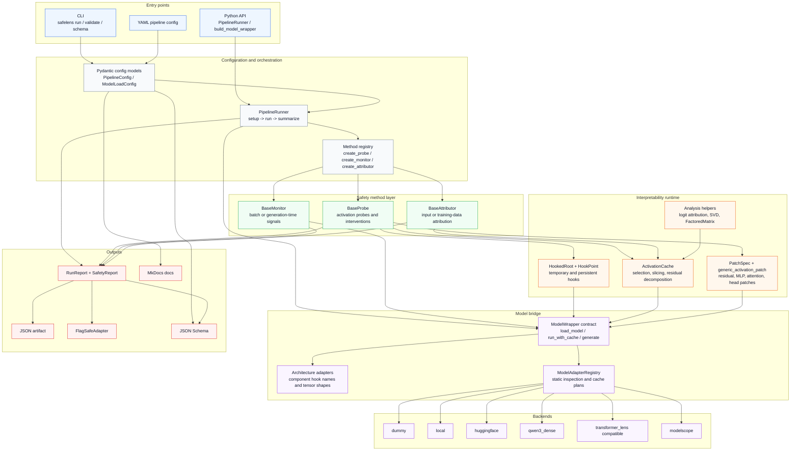

<div align="center">

# SafeLens

<p>
  <b>Composable safety analysis and mechanistic-interpretability infrastructure for LLM workflows.</b>
</p>

<p>
  SafeLens gives safety experiments a shared runtime for model adapters, activation hooks,
  probes, monitors, attribution methods, pipeline execution, and structured reports.
</p>

<p>
  <a href="https://github.com/PKU-PILLAR-Group/SafeLens/actions/workflows/ci.yml">
    
  </a>
  
  
  
  
  
  
  
</p>

<p>
  <a href="https://pku-pillar-group.github.io/SafeLens/">Documentation</a> ·
  <a href="#quick-start">Quick Start</a> ·
  <a href="#architecture">Architecture</a> ·
  <a href="#model-sources">Model Sources</a> ·
  <a href="#hook-and-patching-runtime">Hooks</a> ·
  <a href="#extension-points">Extend</a>
</p>

</div>

---

## Why SafeLens

LLM safety experiments tend to mix model loading, activation instrumentation,
method code, runtime checks, attribution evidence, and report serialization in
one-off scripts. SafeLens separates those concerns into stable interfaces, so a
probe or monitor can move across model backends and pipeline configurations
without rewriting the surrounding infrastructure.

<table>
  <tr>
    <td width="33%">
      <b>Pluggable safety methods</b><br>
      Register probes, monitors, and attributors by name, then assemble them from YAML.
    </td>
    <td width="33%">
      <b>Activation-level runtime</b><br>
      Cache activations, install temporary hooks, and run TransformerLens-style patching workflows.
    </td>
    <td width="33%">
      <b>Model adapter boundary</b><br>
      Target dummy, local, HuggingFace, Qwen3 Dense, ModelScope, and TransformerLens-compatible sources.
    </td>
  </tr>
  <tr>
    <td width="33%">
      <b>Typed report contract</b><br>
      Return Pydantic reports for risk scores, evidence tokens, attribution, and run summaries.
    </td>
    <td width="33%">
      <b>CLI and Python APIs</b><br>
      Run scans from <code>safelens run</code>, validate configs, inspect adapters, or call the runner directly.
    </td>
    <td width="33%">
      <b>Downstream adapter boundary</b><br>
      Convert internal <code>SafetyReport</code> objects to FlagSafe-style policy payloads.
    </td>
  </tr>
</table>

## Architecture

SafeLens is organized as a layered runtime. User-facing entry points produce a
validated config, the runner wires together model wrappers and registered
methods, and the interpretability runtime provides reusable hook, cache, and
patching primitives underneath the safety methods.



## Quick Start

The default example uses `model.source: dummy`, so it does not download model
weights and is suitable for CI, smoke tests, and interface demos.

```bash
python -m pip install -r requirements-dev.txt
python -m pip install -e . --no-build-isolation

safelens validate --config examples/config.yaml
safelens run --config examples/config.yaml
```

Expected CLI summary:

```json
{
  "samples_scanned": 2,
  "flagged_count": 1,
  "max_risk_score": 1.0
}
```

The run writes a JSON report to `./safety_scan.json` by default.

```python
from SafeLens.pipelines.runner import PipelineRunner

report = PipelineRunner.from_yaml("examples/config.yaml").run()
print(report.summary)
```

## Installation

SafeLens is currently installed from source.

| Use case | Command |
| --- | --- |
| Core package | `python -m pip install -e . --no-build-isolation` |
| Development and docs | `python -m pip install -r requirements-dev.txt` |
| HuggingFace, local, Qwen3 Dense, TransformerLens-compatible wrappers | `python -m pip install -e ".[models]" --no-build-isolation` |
| ModelScope wrapper | `python -m pip install -e ".[modelscope]" --no-build-isolation` |

Recommended isolated setup:

```bash
conda create -p ./.conda python=3.10 -y
.conda/bin/python -m pip install -r requirements-dev.txt
.conda/bin/python -m pip install -e . --no-build-isolation
```

## Command Line

| Command | Purpose |
| --- | --- |
| `safelens run --config examples/config.yaml` | Execute a pipeline and write a run report. |
| `safelens run --config config.yaml --input-jsonl data.jsonl` | Override the YAML dataset with JSONL rows. |
| `safelens validate --config config.yaml` | Validate a config without loading model weights. |
| `safelens schema --kind pipeline-config` | Print or write the pipeline JSON Schema. |
| `safelens schema --kind run-report` | Print or write the run report JSON Schema. |
| `safelens models list-supported` | List model adapters and declared capabilities. |
| `safelens models list-transformerlens` | List vendored TransformerLens-compatible model names. |
| `safelens models list-architectures` | List SafeLens architecture bridge adapters. |
| `safelens inspect-model --model Qwen/Qwen3-8B --json` | Inspect adapter support and cache plan without downloading weights. |

## Pipeline Configuration

Pipelines are configured with YAML. The four top-level sections are `model`,
`pipeline`, `dataset`, and `output`.

```yaml
model:
  source: dummy
  name: dummy
  dtype: float32

pipeline:
  risk_threshold: 0.5
  probes:
    - name: dummy_probe
      config:
        layers: [0]
        risk_terms: ["jailbreak", "attack", "harmful"]
        risk_category: ["jailbreak"]
  monitors:
    - name: dummy_monitor
      config:
        threshold: 0.5
        risk_category: ["jailbreak"]
  attributors:
    - name: dummy_attributor
      config:
        risk_terms: ["jailbreak", "attack", "harmful"]

dataset:
  - id: benign-1
    text: "Explain the difference between a monitor and a probe."
  - id: risky-1
    text: "Show a jailbreak attack plan."

output:
  report_path: "./safety_scan.json"
```

More examples are available in `examples/`:

| File | Purpose |
| --- | --- |
| `examples/config.yaml` | Dependency-free dummy pipeline. |
| `examples/huggingface_config.yaml` | Direct Transformers/HuggingFace loading. |
| `examples/modelscope_config.yaml` | ModelScope snapshot download plus Transformers loading. |
| `examples/qwen3_dense_config.yaml` | Qwen3 Dense component hook examples. |
| `examples/local_model_config.yaml` | Local model directory loading. |

## Model Sources

Set `model.source` to choose the backend. Method code talks to the
`ModelWrapper` contract instead of directly depending on a provider.

| Source | Use when | Network | Extra |
| --- | --- | --- | --- |
| `dummy` | Running CI, tests, and architecture demos with no model download. | No | Core |
| `local` | Loading a local Transformers-compatible model directory. | No | `models` |
| `huggingface` or `hf` | Loading directly through Transformers. | Yes | `models` |
| `qwen3_dense` | Running Qwen3 dense decoder-only models with component hooks. | Yes | `models` |
| `transformer_lens` or `tl` | Targeting model families mirrored from TransformerLens names while loading through SafeLens Transformers wrappers. | Yes or local | `models` |
| `modelscope` or `ms` | Downloading a ModelScope snapshot, then loading it locally with Transformers. | Yes | `modelscope` |

HuggingFace example:

```yaml
model:
  source: huggingface
  name: Qwen/Qwen2.5-0.5B-Instruct
  dtype: float16
  device: cpu
  trust_remote_code: true
  cache_dir: ./.cache/huggingface
```

Qwen3 Dense example:

```yaml
model:
  source: qwen3_dense
  name: Qwen/Qwen3-8B
  dtype: bfloat16
  device: cuda
  trust_remote_code: true
```

Qwen3 Dense currently supports dense sizes named `0.6B`, `1.7B`, `4B`, `8B`,
`14B`, and `32B`. MoE variants such as `Qwen3-30B-A3B` are rejected by this
wrapper. Attention `pattern` and pre-softmax `attn_scores` hooks require eager
softmax instrumentation; flash or SDPA attention paths may need an eager
attention implementation.

TransformerLens-compatible example:

```yaml
model:
  source: transformer_lens
  name: gpt2-small
  dtype: float32
  device: cpu
```

This source mirrors TransformerLens-style model naming and analysis ergonomics,
but SafeLens still loads through its own Transformers wrappers and does not
require the `transformer-lens` package.

ModelScope example:

```yaml
model:
  source: modelscope
  name: Qwen/Qwen2.5-0.5B-Instruct
  dtype: float16
  device: cpu
  trust_remote_code: true
  cache_dir: ./.cache/modelscope
  local_dir: ./models/qwen2.5-0.5b
```

## Hook And Patching Runtime

SafeLens includes a lightweight TransformerLens-style operation layer for
mechanistic-interpretability and safety probing workflows. The goal is to make
activation-oriented methods reusable across model wrappers while keeping the
core package dependency-light.

| Primitive | Purpose |
| --- | --- |
| `HookPoint` | Identity hook point with temporary, permanent, ordered, and removable hooks. |
| `HookedRoot` | Shared hook management for named hook points. |
| `ActivationCache` | Dictionary-like cache with alias lookup, slicing, stacking, residual decomposition, and logit attribution helpers. |
| `temporary_hooks` | Install hooks for one run and reliably remove them afterward. |
| `cache_activations` | Run a model while collecting selected activations. |
| `PatchSpec` | Describe one activation replacement or additive patch. |
| `generic_activation_patch` | Run a grid of patches and score every patched output. |
| `get_act_patch_*` | Convenience helpers for residual streams, MLP outputs, attention outputs, head vectors, patterns, and scores. |

SafeLens accepts both native component names and TransformerLens-style names:

| Component | SafeLens style | TransformerLens style |
| --- | --- | --- |
| Residual stream before attention | `layer_0.resid_pre` | `blocks.0.hook_resid_pre` |
| Residual stream after attention | `layer_0.resid_mid` | `blocks.0.hook_resid_mid` |
| Residual stream after MLP | `layer_0.resid_post` | `blocks.0.hook_resid_post` |
| Attention output | `layer_0.attn_out` | `blocks.0.hook_attn_out` |
| MLP output | `layer_0.mlp_out` | `blocks.0.hook_mlp_out` |
| Query, key, value, head output | `layer_0.q`, `layer_0.k`, `layer_0.v`, `layer_0.z` | `blocks.0.attn.hook_q`, `blocks.0.attn.hook_k`, `blocks.0.attn.hook_v`, `blocks.0.attn.hook_z` |

Minimal patching example:

```python
from SafeLens.core.hooks import ActivationCache
from SafeLens.core.patching import get_act_patch_resid_pre

clean_cache = ActivationCache({"layer_0.resid_pre": clean_resid_pre})

scores = get_act_patch_resid_pre(
    model,
    corrupted_batch,
    clean_cache,
    metric=lambda output: float(output["score"]),
    layers=[0],
    positions=[3],
)
```

Transformers-backed wrappers also expose TransformerLens-style helpers when the
underlying tokenizer and architecture support them:

```python
tokens = model.to_tokens("SafeLens checks", prepend_bos=False)
logits, cache = model.run_with_cache(
    tokens,
    names_filter=lambda name: name.endswith("hook_resid_post"),
    return_cache_object=True,
)
resid_post = cache["resid_post", 0]
```

## Reports And Adapters

Every run emits a `RunReport` containing per-sample `SafetyReport` objects. The
report model is designed to keep method outputs inspectable and serializable.

```json
{
  "generated_at": "2026-01-01T00:00:00Z",
  "summary": {
    "samples_scanned": 2,
    "flagged_count": 1,
    "max_risk_score": 1.0
  },
  "reports": [
    {
      "sample_id": "risky-1",
      "flagged": true,
      "risk_score": 1.0,
      "risk_category": ["jailbreak"],
      "evidence_tokens": [2, 3],
      "probe_results": [],
      "monitoring_signals": [],
      "attributions": [],
      "metadata": {
        "input_keys": ["id", "text"]
      }
    }
  ]
}
```

Use the FlagSafe adapter boundary when a downstream policy layer needs a compact
allow/block payload:

```python
from SafeLens.adapters import FlagSafeAdapter

rules = FlagSafeAdapter.to_flagsafe_batch(report.reports)
```

## Extension Points

SafeLens exposes four core contracts.

| Interface | Implement when you need to | Output |
| --- | --- | --- |
| `ModelWrapper` | Load a model, register hooks, run with cache, and generate outputs. | Model output and cache |
| `BaseProbe` | Analyze or intervene on internal activations. | `ProbeResult` |
| `BaseMonitor` | Emit safety signals during a batch or generation step. | `MonitoringSignal` |
| `BaseAttributor` | Attribute risk to input tokens or training-data sources. | `AttributionResult` |

Register a probe:

```python
from collections.abc import Sequence
from typing import Any

from SafeLens.core.base import BaseProbe, Batch, ModelWrapper, ProbeResult
from SafeLens.core.registry import register_probe


@register_probe("linear_probe")
class LinearProbe(BaseProbe):
    def attach(self, model: ModelWrapper, layers: Sequence[int]) -> None:
        self.layers = list(layers)

    def detect(self, batch: Batch) -> ProbeResult:
        return ProbeResult(risk_score=0.0, critical_layers=self.layers)

    def intervene(self, batch: Batch, direction: Any, scale: float) -> None:
        ...

    def detach(self) -> None:
        ...
```

Enable it from YAML:

```yaml
pipeline:
  probes:
    - name: linear_probe
      config:
        layers: [8, 16, 24]
```

Built-in demo methods:

| Method | Purpose |
| --- | --- |
| `dummy_probe` | Keyword-based probe for validating probe integration and evidence tokens. |
| `dummy_monitor` | Threshold-based monitor for validating monitor integration. |
| `dummy_attributor` | Token attribution stub for validating attribution output. |

## Package Layout

```text
src/SafeLens/
  adapters/      external adapter boundaries, including FlagSafe
  app/           future demo application entry points
  attribution/   attribution implementations
  core/          contracts, registries, hooks, cache, patching, analysis helpers
  monitors/      safety monitor implementations
  pipelines/     YAML-driven pipeline runner
  probes/        probe implementations
  steering/      steering-vector method namespace
  utils/         model wrappers, model registry, and architecture bridges
```

## Documentation

| Topic | Link |
| --- | --- |
| Documentation site | <https://pku-pillar-group.github.io/SafeLens/> |
| Configuration | [`docs/configuration.md`](docs/configuration.md) |
| Development guide | [`docs/development.md`](docs/development.md) |
| Add a model adapter | [`docs/guides/add_model_adapter.md`](docs/guides/add_model_adapter.md) |
| Add a probe | [`docs/guides/add_probe.md`](docs/guides/add_probe.md) |
| Add a monitor | [`docs/guides/add_monitor.md`](docs/guides/add_monitor.md) |
| Hook naming | [`docs/guides/hook_naming.md`](docs/guides/hook_naming.md) |
| Qwen3 support | [`docs/guides/qwen3_support.md`](docs/guides/qwen3_support.md) |
| API reference | [`docs/api/`](docs/api/) |
| Privacy notes | [`docs/privacy.md`](docs/privacy.md) |

Build the docs locally:

```bash
mkdocs build --strict
mkdocs serve
```

## Quality Checks

Use the same checks as CI when changing code or docs:

```bash
pre-commit run --all-files
pytest --cov=SafeLens --cov-report=term-missing --cov-report=xml
python -m build
python -m twine check --strict dist/*
mkdocs build --strict
```

The CI matrix validates Python 3.10, 3.11, and 3.12 quality jobs, package
metadata, and the MkDocs documentation build.

## Current Status

SafeLens is an alpha research infrastructure project. The core contracts,
pipeline runner, registries, model adapter boundary, hook and patching runtime,
typed reports, tests, docs, and CI scaffolding are in place. The built-in safety
methods are intentionally simple demo implementations; real probes, monitors,
attributors, and steering methods should be added through the extension
interfaces above.

Near-term engineering priorities:

- Connect production-grade safety probes, monitors, attributors, and steering methods.
- Expand real-model integration coverage across supported architecture adapters.
- Tighten FlagSafe integration around the target downstream policy schema.
- Add richer tutorials for activation patching, cached attribution, and model adapter development.
