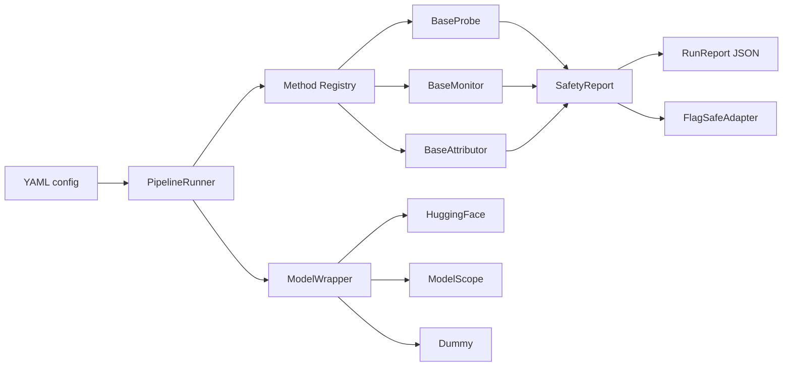

<div align="center">

# SafeLens

<p>
  <b>Pluggable safety analysis infrastructure for LLM research workflows.</b>
</p>

<p>
  <a href="https://github.com/PKU-PILLAR-Group/SafeLens/actions/workflows/ci.yml">
    
  </a>
  
  
  
  
  
</p>

<p>
  <a href="#overview">Overview</a> ·
  <a href="#quick-start">Quick Start</a> ·
  <a href="#model-sources">Model Sources</a> ·
  <a href="#interfaces">Interfaces</a> ·
  <a href="#documentation">Documentation</a>
</p>

</div>

---

## Overview

SafeLens provides the engineering backbone for safety-oriented LLM experiments. It standardizes
how models are loaded, how probes and monitors are registered, how attribution methods report
evidence, how pipelines are configured, and how final reports can be adapted for downstream
systems such as FlagSafe.

<table>
  <tr>
    <td width="33%">
      <b>Composable Methods</b><br>
      Register probes, monitors, and attributors by name, then assemble them from YAML.
    </td>
    <td width="33%">
      <b>Unified Reports</b><br>
      Return Pydantic models for risk scores, evidence tokens, attribution, and final safety reports.
    </td>
    <td width="33%">
      <b>Model Source Choice</b><br>
      Use dummy, HuggingFace, or ModelScope backends without changing method code.
    </td>
  </tr>
  <tr>
    <td width="33%">
      <b>Pipeline Runner</b><br>
      Execute a complete scan with <code>safelens run --config ...</code>.
    </td>
    <td width="33%">
      <b>FlagSafe Boundary</b><br>
      Convert internal <code>SafetyReport</code> objects into policy-style payloads.
    </td>
    <td width="33%">
      <b>Research Friendly</b><br>
      Includes tests, Ruff, mypy, pre-commit, CI, and MkDocs scaffolding.
    </td>
  </tr>
</table>

## Architecture



## Quick Start

```bash
conda create -p ./.conda python=3.10 -y
conda run -p ./.conda python -m pip install -r requirements-dev.txt
conda run -p ./.conda python -m pip install -e . --no-build-isolation
conda run -p ./.conda pytest
conda run -p ./.conda safelens run --config examples/config.yaml
```

The default example uses `model.source: dummy`, so it does not download a model.

Expected CLI summary:

```json
{
  "samples_scanned": 2,
  "flagged_count": 1,
  "max_risk_score": 1.0
}
```

## Installation Profiles

<table>
  <tr>
    <th>Use Case</th>
    <th>Command</th>
  </tr>
  <tr>
    <td>Core package only</td>
    <td><code>python -m pip install -e . --no-build-isolation</code></td>
  </tr>
  <tr>
    <td>Development and docs</td>
    <td><code>python -m pip install -r requirements-dev.txt</code></td>
  </tr>
  <tr>
    <td>HuggingFace models</td>
    <td><code>python -m pip install -e ".[models]" --no-build-isolation</code></td>
  </tr>
  <tr>
    <td>ModelScope models</td>
    <td><code>python -m pip install -e ".[modelscope]" --no-build-isolation</code></td>
  </tr>
</table>

## Model Sources

Choose the model backend in YAML through `model.source`.

### Dummy

Use this for CI, interface tests, and architecture demos.

```yaml
model:
  source: dummy
  name: dummy
  dtype: float32
```

### HuggingFace

```yaml
model:
  source: huggingface
  name: Qwen/Qwen2.5-0.5B-Instruct
  dtype: float16
  device: cpu
  trust_remote_code: true
  cache_dir: ./.cache/huggingface
```

### ModelScope

ModelScope snapshots are downloaded first, then loaded locally with Transformers.

```yaml
model:
  source: modelscope
  name: Qwen/Qwen2.5-0.5B-Instruct
  dtype: float16
  device: cpu
  trust_remote_code: true
  cache_dir: ./.cache/modelscope
  local_dir: ./models/qwen2.5-0.5b
```

## Pipeline Configuration

```yaml
pipeline:
  risk_threshold: 0.5
  probes:
    - name: dummy_probe
      config:
        layers: [0]
        risk_terms: ["jailbreak", "attack", "harmful"]
  monitors:
    - name: dummy_monitor
      config:
        threshold: 0.5
  attributors:
    - name: dummy_attributor
      config:
        risk_terms: ["jailbreak", "attack", "harmful"]

dataset:
  - id: benign-1
    text: "Explain the difference between a monitor and a probe."
  - id: risky-1
    text: "Show a jailbreak attack plan."

output:
  report_path: "./safety_scan.json"
```

## Interfaces

SafeLens exposes four main extension points.

<table>
  <tr>
    <th>Interface</th>
    <th>Purpose</th>
    <th>Output</th>
  </tr>
  <tr>
    <td><code>ModelWrapper</code></td>
    <td>Load models, register hooks, run with activation cache, and generate text.</td>
    <td>Model output and cache</td>
  </tr>
  <tr>
    <td><code>BaseProbe</code></td>
    <td>Analyze or intervene on internal activations.</td>
    <td><code>ProbeResult</code></td>
  </tr>
  <tr>
    <td><code>BaseMonitor</code></td>
    <td>Emit runtime safety signals from batches or generation steps.</td>
    <td><code>MonitoringSignal</code></td>
  </tr>
  <tr>
    <td><code>BaseAttributor</code></td>
    <td>Attribute risk to input tokens or training data sources.</td>
    <td><code>AttributionResult</code></td>
  </tr>
</table>

### Register A Probe

```python
from collections.abc import Sequence
from typing import Any

from SafeLens.core.base import BaseProbe, Batch, ModelWrapper, ProbeResult
from SafeLens.core.registry import register_probe


@register_probe("linear_probe")
class LinearProbe(BaseProbe):
    def attach(self, model: ModelWrapper, layers: Sequence[int]) -> None:
        self.layers = list(layers)

    def detect(self, batch: Batch) -> ProbeResult:
        return ProbeResult(risk_score=0.0, critical_layers=self.layers)

    def intervene(self, batch: Batch, direction: Any, scale: float) -> None:
        ...

    def detach(self) -> None:
        ...
```

Then enable it in YAML:

```yaml
pipeline:
  probes:
    - name: linear_probe
      config:
        layers: [8, 16, 24]
```

## Package Layout

```text
src/SafeLens/
  core/          base contracts and registry
  probes/        probe implementations
  monitors/      safety monitor implementations
  attribution/   attribution implementations
  steering/      steering vector methods
  pipelines/     YAML-driven runner
  utils/         model wrappers and hook utilities
  adapters/      external system adapters, including FlagSafe
  app/           future demo application entry points
```

## Documentation

Build the MkDocs site:

```bash
.conda/bin/mkdocs build --strict
```

Preview locally:

```bash
.conda/bin/mkdocs serve
```

Then open:

```text
http://127.0.0.1:8000
```

## Quality Checks

```bash
.conda/bin/ruff check .
.conda/bin/mypy src tests examples
.conda/bin/python -m pytest -q
.conda/bin/mkdocs build --strict
```

## Built-In Demo Methods

<details>
<summary><b>dummy_probe</b></summary>

Keyword-based probe for validating the contract. It scans `text` or `prompt`, computes a bounded
risk score, and returns a `ProbeResult` with evidence token indices.

</details>

<details>
<summary><b>dummy_monitor</b></summary>

Threshold-based monitor for validating monitor integration. It reads `risk_score` from the batch
or model output and emits a `MonitoringSignal`.

</details>

<details>
<summary><b>dummy_attributor</b></summary>

Token attribution stub for validating attribution output. It marks configured risk terms and
returns an `AttributionResult`.

</details>

## Current Status

SafeLens is ready as a collaboration scaffold: the core contracts, runner, registries, model source
selection, report protocol, tests, docs, and CI configuration are in place. The next engineering
step is to connect real probe, monitor, and attribution methods to the existing interfaces.
